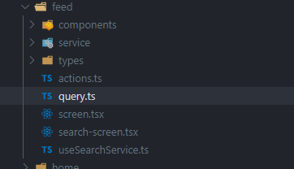

We have used a GraphQL with apollo-graphql to fetch data from the server instead of the Wordpress Rest API. So you need to understand how GraphQL works to be able to modify and add new queries. All the basics of GraphQL are explained in this [link](https://www.howtographql.com/) which is a good start to mastery all you need.

You can also watch to the followings youtube videos we found interesting:

<figure class="video-container">
<iframe src="//www.youtube.com/embed/VjXb3PRL9WI" frameborder="0" allowfullscreen width="100%" height="450"></iframe>
</figure>
<br>
<figure class="video-container">
<iframe src="//www.youtube.com/embed/7wzR4Ig5pTI" frameborder="0" allowfullscreen width="100%" height="450"></iframe>
</figure>
<br>

<figure class="video-container">
<iframe src="//www.youtube.com/embed/anW5Qpuh5kI" frameborder="0" allowfullscreen width="100%" height="450"></iframe>
</figure>
<br>

As you may have seen exploring the app's file structure we defined all the graphql queries for a feature into a file
called query.ts.



And all the typescript types for each query defined in this file are generated into a folder named types.

Let's explore a GraphQL query from the feed screen, which fetch shoes from the woocommerce backend that uses wp-graphql and wp-graphql-woocommerce plugins to handle this query.

---

> All constant names are in camelcase and end with the word QUERY/UPDATE/SUBSCRIPTION, it starts with the Http's method name in camelcase deciding which action this query intended. The GraphQL query inside the gql string parameter should be the name of the constant without the word QUERY/UPDATE/SUBSCRIPTION at the end and the Http's method at the beginning. For fragment constants names, they end with FRAGMENTS and start with the name of the type its fields refer.

```typescript
const PRODUCT_FRAGMENTS = {
  fragments: {
    fields: gql
      fragment ProductsDocumentFields on Product {
        shoes_details {
          make
          model
        }
        id
        name
        productId
        image {
          mediaItemUrl
        }
        averageRating
        ... on SimpleProduct {
          price
          regularPrice
          salePrice
        }
        ... on VariableProduct {
          price
          regularPrice
          salePrice
        }
      }
    ,
  },
};

const GET_PRODUCTS_QUERY = gql
  query PRODUCTS(
    $first: Int
    $tag: String
    $category: String
    $after: String
    $search: String
    $minPrice: Float
    $maxPrice: Float
    $taxonomyFilter: [ProductTaxonomyFilterRelationInput]
    $include: [Int]
  ) {
    products(
      first: $first
      after: $after
      where: {
        tag: $tag
        category: $category
        search: $search
        minPrice: $minPrice
        maxPrice: $maxPrice
        taxonomyFilter: $taxonomyFilter
        include: $include
      }
    ) {
      edges {
        node {
          ...ProductsDocumentFields
        }
      }
      pageInfo {
        endCursor
        hasNextPage
        hasPreviousPage
        startCursor
      }
    }
  }

  ${ProductsDocument.fragments.fields}
;
```

This query uses a fragment to load all the data needed to display the necessary information of a product into the feed screens. If you have a better understanding of GraphQL, you will be able to modify this query and load other information you may need for your specific needs.

> NOTE: If you define a new graphql query, do not forget to run the command:

```bash
yarn generate-types
```

> to get all the typescript types from this query as it will make you life easier when you will use it in your components.
