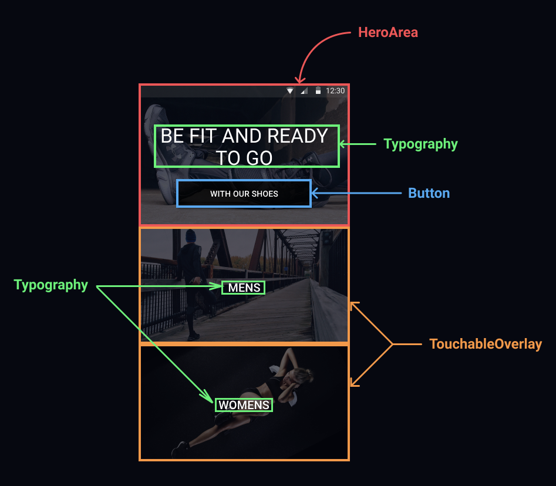

The home screen is represented by the following picture:

As you can see this picture can be built using the mainly 4 components :

1. HeroArea
2. Typography
3. Button
4. TouchableOverlay

You can explore the API to understand deeply which properties these components expect.

If you want to explore the code you will see that I use another component to construct the **HeroArea** and the **TouchableOverlay** components.
