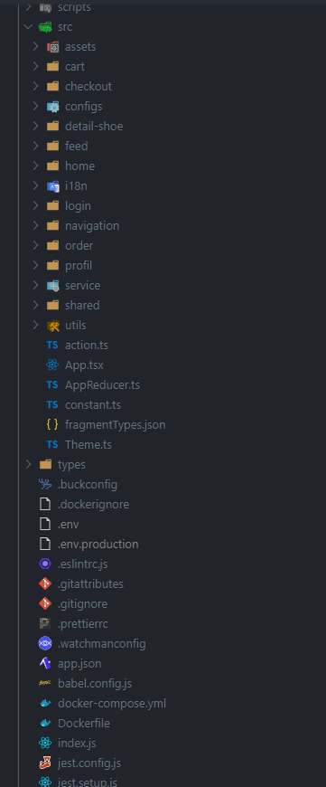
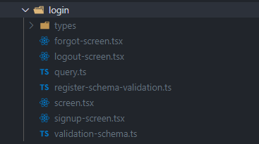

We have structured this app by features as we think it will be better for developers who will use this source code to quickly find components they want and set up their app. So we have grouped almost all screens by feature as explained in the [faq of react.js link](https://reactjs.org/docs/faq-structure.html).

And make some adjustments to avoid the creation of new folders which we have thought it wasn't necessary. As for screens related to the login process (Sign In, Sign Up) we have packed then into the login folder

Once developers will be familiar with the file structure and how we have organized this app. The next step should be to understand which commands we use in our workflow to be able to add/modify the feature's code.
