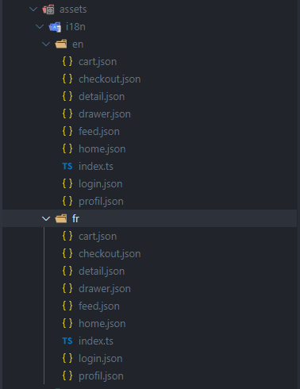

We have developed this app using the best components today to build a react native app. And we have made each component using the functional and hook in our codebase. In this section, we will explain the anatomy of each feature and how we have internationalized this app to make it easy to add another language as now we have only English and French.

## Translation

Apps related to e-commerce have to be accessible in many languages. To achieve this goal we have used a plugin called react-i18next. It helps us implement internationalization easily. To make it even easier for translators, we have grouped string by features as you can see in the picture. This way it is easy to find words related to a feature.



To use these translated strings, we set up a json as described by the following code snippets:

```javascript
const home = require("./home.json");
const feed = require("./feed.json");
const detail = require("./detail.json");
const cart = require("./cart.json");
const drawer = require("./drawer.json");
const checkout = require("./checkout.json");
const profil = require("./profil.json");
const login = require("./login.json");

const languageConfig = {
  home,
  feed,
  detail,
  cart,
  drawer,
  checkout,
  profil,
  login,
};

export default languageConfig;
```

This JSON is passed to the react-i18next plugin which handles the loading and offers a well-done API through the useTranslation hook to load different namespace like home, feed, or detail like this:

```javascript
useTranslation('home') or useTranslation('feed')
```

## Feature anatomy

Each dynamic feature in this app is composed of hooks, react/react-native components composed to make it usable in resolving the feature's problem and theme which is used to theming each component of this app according to material design system with the help of the react-native-paper UI framework

### GraphQL hook

Which help to get information from the server and modify data in the database on the server-side

- **GraphQL query**

```javascript
const { loading, error, data, refetch, networkStatus, fetchMore } = useQuery<
  PRODUCTS,
  PRODUCTSVariables
>(GET_PRODUCTS_QUERY, {
  variables: {
    first: 25,
    category,
    tag,
  },
  notifyOnNetworkStatusChange: true,
  errorPolicy: "all",
});
```

- **GraphQL mutation**

```javascript
const [addToCart, { loading, error, data }] =
    useMutation<ADD_PRODUCT_TO_CART, ADD_PRODUCT_TO_CARTVariables>(
        ADD_TO_CART_MUTATION,
    )
```

### Transalation hook

which help in the internationalization of screens

```javascript
const { t } = useTranslation("detail");
```

### custom hooks

which help us in abstracting and cleaning our codebase.

```javascript
const {
  feedContextValue,
  isFilter,
  filterState,
  isLoading,
  onResetFilter,
  openFilter,
  hasError,
  feeds,
  fetchMoreFeeds,
  refresh,
} = useFeeds({ category, tag, t, filterValues });
```

### react/react native component:

This part should be self-explanatory by exploring the app's codebase.

### Theming

We decide to use the material design system to make this app aesthetic. To help us in this task we have used the react-native-paper UI framework which is a great plugin if you decide to build a react native app related to the material design system. You can learn more about this framework through this [link](https://callstack.github.io/react-native-paper/)

Some feature need to be accessible from the drawer and can be related to the authenticated user.

## Drawer

As you can see we have set up a drawer system to handle multiple menus in this app. We have done this using the react-navigation plugin.
To add a new menu you should first read the official documentation about drawer navigation describe in this [link](https://reactnavigation.org/docs/3.x/drawer-based-navigation)

To make the drawer menu's title easy to translate in multiple languages and be able to handle the different menu between an authenticated user and an unauthenticated user we have defined some useful components:

- **drawerNavigationOptions**

It helps us to abstract the definition of a different menu as an example let's examine the following sample code :

```javascript
drawerNavigationOptions({
  i18nKey: "wishlist_title",
  namespace: "profil",
  iconName: "list",
});
```

This function call returns all options necessary to define the wishlist menu with its corresponding icon and its translated title.

- **DrawerLabel**

It helps translated the title and handle the state of a menu.

- **DrawerIcon**

It helps to abstract the icon of the menu.

To add a new menu in the drawer, examine the MainNavigator.tsx file inside the navigation folder. You will see the DrawerFeedStack component. Add a new option in the JSON configuration, define the icon, and add the title of the menu in the corresponding translated file.

If your new menu is related to the authenticated user, and should not be displayed when the user is unauthenticated, open the config.ts inside the navigation folder and add its JSON config key to the corresponding key "authenticated_menus" or "unauthenticated_menus".

After this step, you should see this new menu display in the drawer.
